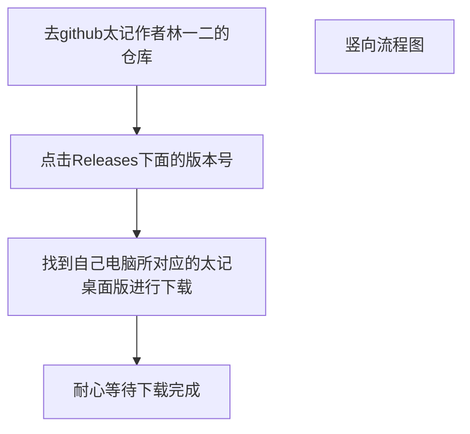
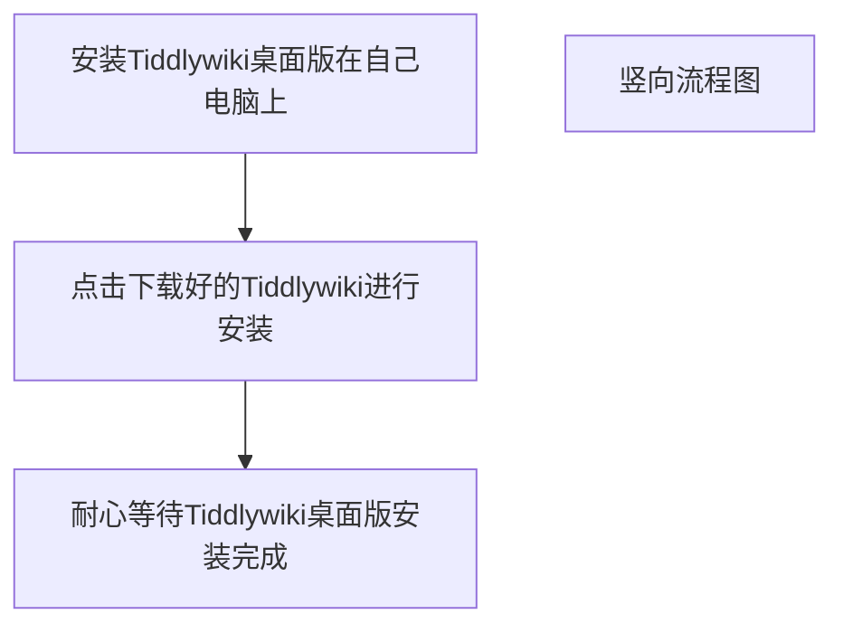
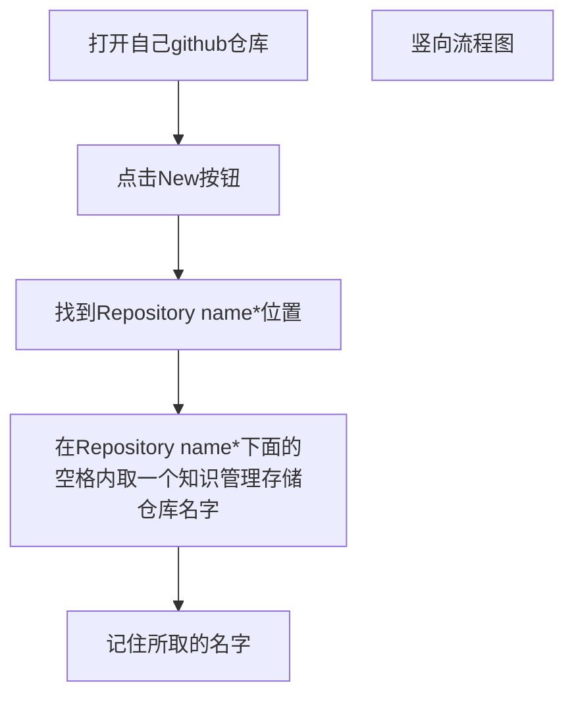
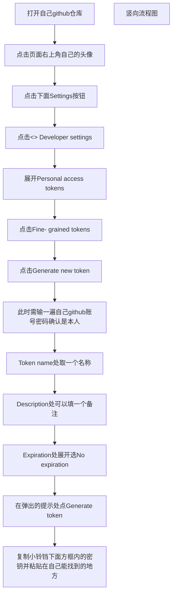
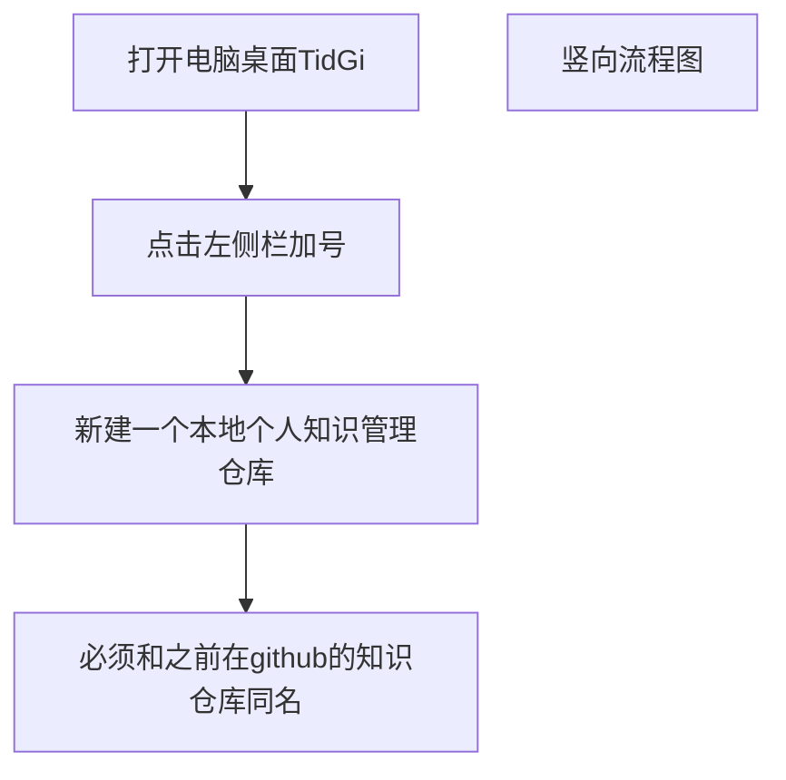
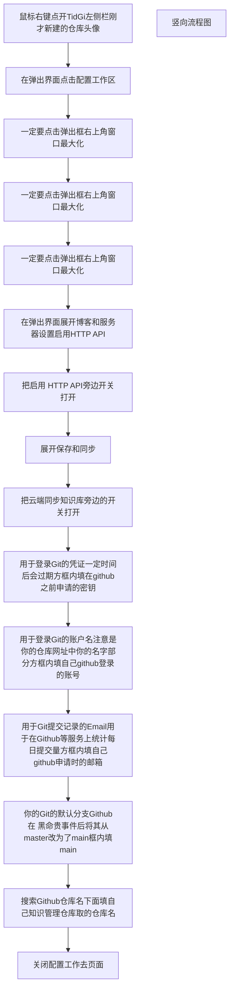
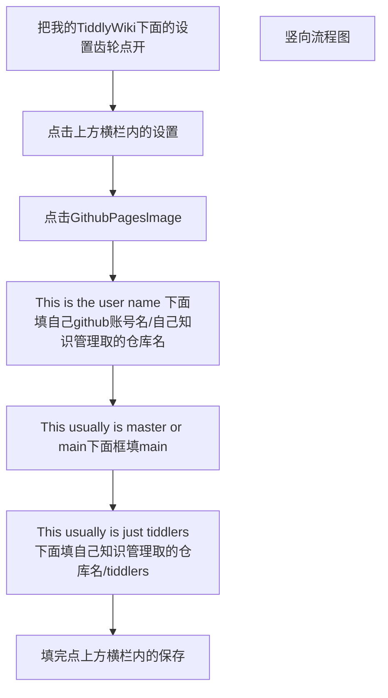
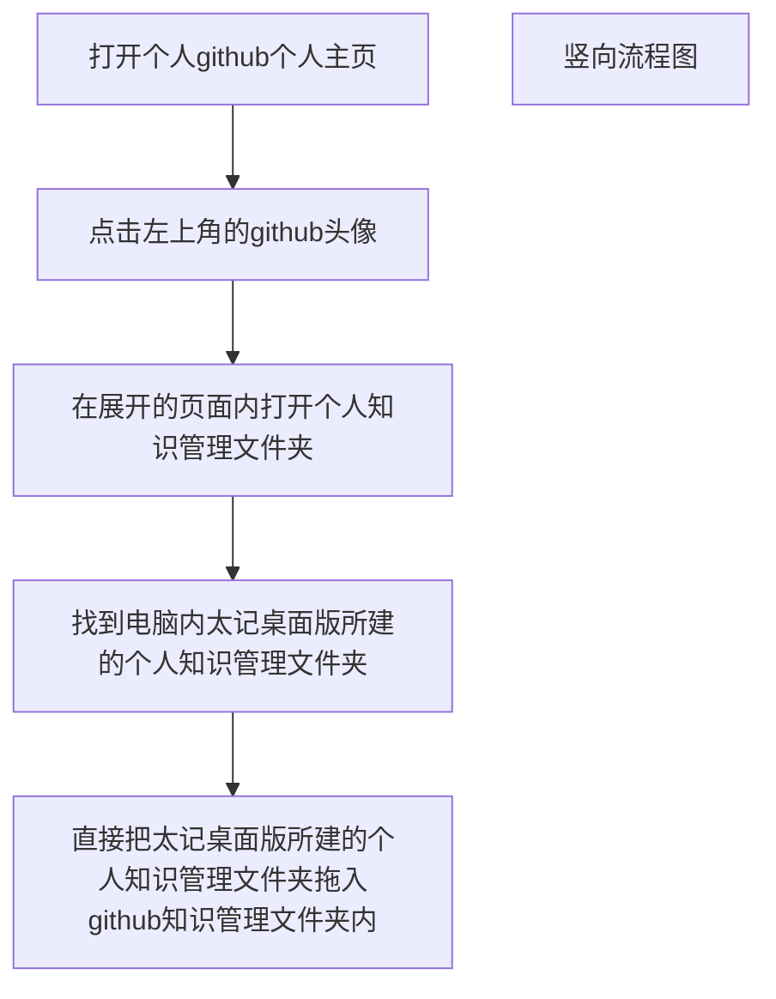
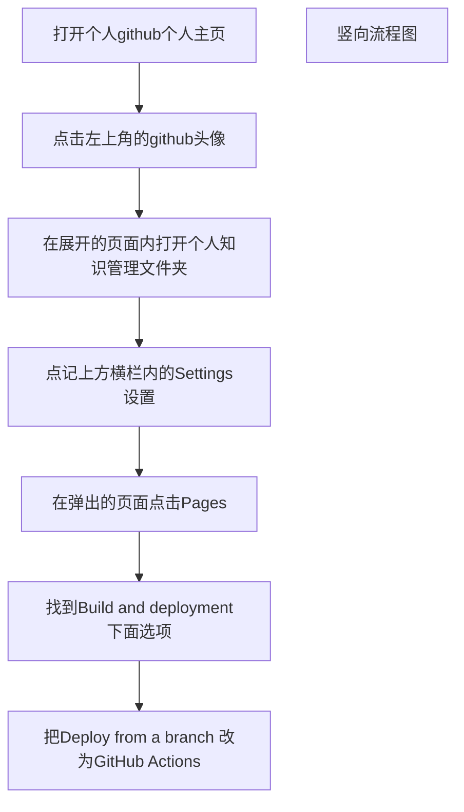

[English](/README.md) | [中文](/README_zh-CN.md)

# Tiddlywiki-NodeJS-Github-Template

Default wiki template for [TidGi-Desktop](https://github.com/tiddly-gittly/TidGi-Desktop), an App that can generate template wiki on one-click.

Knowledge base Template, with advanced filter search and faceted data aggregation.

[onetwo.ren/wiki](https://onetwo.ren/wiki) is an example of this template. And [tiddly-gittly.github.io/Tiddlywiki-NodeJS-Github-Template/](https://tiddly-gittly.github.io/Tiddlywiki-NodeJS-Github-Template/) is deployed example of this repo. (There are some optimization to make this demo readonly, and being not downloadable, so its size is almost as small as a GIF picture.)

You need to change the contents of the `$:/GitHub/Repo` entry to your personal github repository address.The default branch is master, you can manually change the `$:/core/templates/canonical-uri-external-image` entry to another branch such as main.

Downloadable HTML is at [tiddly-gittly.github.io/Tiddlywiki-NodeJS-Github-Template/offline.html](https://tiddly-gittly.github.io/Tiddlywiki-NodeJS-Github-Template/offline.html), which contains edit related plugins, and will be slightly bigger (a size of a tiktok video.)

Also there is a TiddlyHost template at [tiddlyhost.com/hub/user/linonetwo](https://tiddlyhost.com/hub/user/linonetwo), which will update manually when I remember it. (It is same as, download the offline version above, and upload to a newly created tiddlyhost wiki.)

This repo used to contains the wiki backup data and script to start a local wiki server on MacOS on start up. It is now deprecated, and no money to maintain, now [TiddlyGit-Desktop](https://github.com/tiddly-gittly/TiddlyGit-Desktop) is preferred. Old version can be found at the [feat/auto-start branch](https://github.com/tiddly-gittly/Tiddlywiki-NodeJS-Github-Template/tree/feat/auto-start). Contribution to it is welcome.

## Setup

[用TiddlyWiki替代Notion和EverNote作为个人知识管理系统 (Chinese)](https://onetwo.ren/%E7%94%A8tiddlywiki%E6%9B%BF%E4%BB%A3notion%E5%92%8Cevernote%E7%AE%A1%E7%90%86%E7%9F%A5%E8%AF%86/)

English translation comeout soon. (?)

## Deployed to Github Pages

Automatically.

## NPM Scripts

`npm build`: pack tiddlywiki data to a HTML file

## Shell Scripts

[scripts/build-wiki.js](scripts/build-wiki.js) will actually pack tiddlywiki data to a HTML file

## Credit

Scripts are inspired by [DiamondYuan/wiki](https://github.com/DiamondYuan/wiki)

---
title: Tiddlywiki个人知识管理存储教程（小白向）
---

# 一、构建个人知识管理的步骤
## 1、下载[tiddly-gittlyTidGi-Desktop太记桌面版](https://github.com/tiddly-gittly/TidGi-Desktop)
详情：点击上面的链接去到**太记作者林一二***github的代码仓库下载>个人知识管理的软件*
下载步骤如下：

## 2、安装Tiddlywiki（太记）桌面版在自己电脑上
详情：

## 3、在自己github账号下新建一个个人知识管理存储的代码仓库（记住仓库的命名）

详情:

## 4、在自己github账号下申请一个Fine- grained tokens（细粒度token），并开启全部权限

## 5、在自己电脑的TidGi-Desktop（太记桌面版）内建立一个个人知识管理仓库（必须与github账号下新建的个人知识管理存储的代码仓库同名）

## 6、对自己电脑里的TidGi-Desktop（太记桌面版）内新建的个人知识管理仓库进行设置

**配置工作区**

详情配置：

> 备注：为什么“一定要点击弹出框右上角窗口最大化”这一项如此重要，那是因为多数人配置都是这一步配置不好

**配置我的TiddlyWiki电脑端GithubPageslmage**

详情配置：

## 7、把自己电脑里的TidGi-Desktop（太记桌面版）内新建的个人知识管理仓库拖入github账号下的个人知识管理存储的代码仓库

**拖电脑知识管理文件夹到github知识管理文件夹内**

详情：

**设置github的网页展示**

详情：

> **此教程内最重要的两点：**
>
> ​                                    **1、配置电脑内工作区时，一定要点击弹出框右上角窗口最大化。**
>
> ​                                    **2、配置设置github的网页展示时，把Deploy from a branch 改为GitHub Actions **
>
> 
